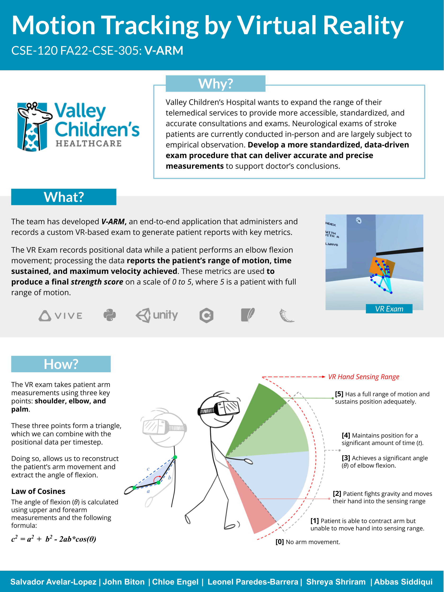
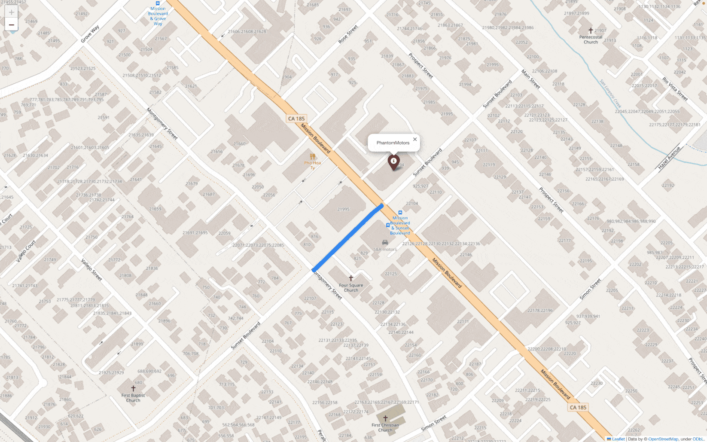

# Abbas Siddiqui

## Contact Information
- **Email:** siddiquiabbas22@gmail.com
- **GitHub:** [Github](https://github.com/ANRC2020)
- **LinkedIn:** [Linkedin](https://www.linkedin.com/in/abbas-siddiqui-5434b71aa/)

## About

I recently graduated from UC Berkeley’s Master of Information and Data Science (MIDS) program, after earning my B.S. in Applied Mathematics and Computer Science from UC Merced. My journey into machine learning and data science began with a deep interest in chess—where exploring how top engines made decisions sparked a broader fascination with optimization, strategy, and intelligent systems.
Since then, I’ve worked on a range of impactful projects, from protein-receptor modeling at Lawrence Livermore National Lab to immersive VR diagnostics at Valley Children’s Hospital. I’ve also led the design and deployment of full-stack ML systems in cloud environments, gaining hands-on experience with tools like Docker, Kubernetes, Azure, and MLOps best practices.
I'm driven by a passion for continuous learning—constantly looking to sharpen my technical skills, expand my perspective, and grow as both a data scientist and a person. I believe in building AI systems that are scalable, impactful, and developed with care for privacy and ethical integrity.

## Education
- **University of California, Berkeley** (January 2024 - May 2025)  
  *Master of Information and Data Science*

**Selected Coursework:**  
Applied Machine Learning | Statistics | Fundamentals of Data Engineering | Statistical Methods of Time Series Data | Machine Learning at Scale | Machine Learning Systems Engineering | Generative AI

- **University of California, Merced** (August 2019 - May 2023)  
  *Bachelor of Science, Majors in Computer Science & Applied Mathematics*  
  - **Top Finisher** for Innovate to Grow Event for 2022 Fall Software Engineering Capstone

**Selected Coursework:**  
 Machine Learning | Modern Applied Statistics | Databases | Stochastic Processes | Optimization

 

## Programming Skills
- **Languages:** Python, SQL, R, C++, JavaScript, HTML, CSS, MATLAB, Java, C
- **Technologies:**  PyTorch; TensorFlow; Scikit-Learn; Keras; Docker; Kubernetes; FastAPI; Redis; TMUX; AWS; GCP; Azure; Databricks; PySpark; Hadoop; LangChain; Jupyter; Pandas; Numpy; Matplotlib; SQL; Git; Linux
  
## Experience

### Research Assistant | University of California Merced | August 2022 - May 2023
Developed and tested policy optimization techniques using quasi-Newton methods under a reinforcement learning regime (DQN). Experimented with optimization techniques to approximate Hessian matrix to reduce training time and calculation overhead costs. Managed to reduce the training time by 20-30% against Mujuco benchmark environments using Pytorch.

### Software Engineer Intern | Valley Children's Hospital | August 2022 - December 2022
Led the development of a proof-of-concept application for real-time tracking and analysis of stroke patients' performance in a variety of hand-eye coordination tasks to make medical assessments accessible to those unable to travel safely and to provide medical professionals with accurate analyses to help in their decision-making process. Managed the extraction, analysis, and storage of patients' spatial data and visualizations and reports of their progress over time.  Developed a frontend system for doctors to order and view the results of their patients' tests and recovery over time. Significantly reduced the time needed for patients to get diagnosed (15 minutes + travel times reduced to ~1-2 minutes at home). The project was recognized as the Top Finisher at the Innovate to Grow Event.

**Project Poster:**  

 
 

### Data Science Intern | Lawrence Livermore National Laboratory | May 2022 - June 2022
Conducted protein structure data analysis, focusing on using protein structures and chemical properties to accelerate the testing process for finding compounds capable of binding to the SARS-COVID 19 virus for vaccine synthesis. Developed a 3-dimensional convolutional neural network that achieved 75% test accuracy in identifying proteins more likely to bind to the virus's receptor sites. 

*Project Presentation:* 
<iframe 
    src="assets/img/gifs/LLNL DSC Team 1 .pptx.pdf" 
    width="800" 
    height="500">
</iframe>

## Relevant Projects

### BookWise – Explainable Recommendation System (Capstone Project)

Description: BookWise is an AI‑powered recommendation engine that delivers personalized book suggestions with transparent, user-specific reasoning. Built with Python, TensorFlow, Matplotlib, and scikit-learn, the system uses a two-tower model trained on over 76,000 historical user interactions across 230,000 unique books. Hosted on AWS SageMaker and integrated with AWS Bedrock, the system also fine-tunes LLMs to generate natural language explanations that reflect user preferences, past behavior, and broader reading trends.

Users receive recommendations alongside clear, tailored explanations and can provide real-time feedback to refine their profiles, enabling a continually evolving, interactive experience. The platform was deployed with Streamlit, SQL, and EC2 to connect the full pipeline from model to interface.

More information and a demo can be viewed at the iSchool Berkeley capstone website.

Demo & Details: View on iSchool Berkeley 
[View on iSchool Berkeley](https://www.ischool.berkeley.edu/projects/2025/bookwise)

### Retrieval-Augmented Generation (RAG) System for Generative AI Support

Designed and deployed personalized RAG systems to assist research and marketing teams with generative AI-related queries, tailored to their domain expertise and specific use cases. Leveraged embedding models, Qdrant vector stores, custom prompt engineering, and LLM tuning to ensure the responses aligned with each team's informational needs and technical fluency. Evaluated performance using ROUGE-L and BERTScore to measure structural and contextual alignment with ground-truth answers, and optimized retriever configurations by analyzing precision and recall @k. Fine-tuned chunk size and overlap for each RAG to maximize answer relevance and retrieval efficiency.

GitHub Repository:
[https://github.com/ANRC2020/Generative_AI_RAG.git]

### Flight Delay Prediction and Analysis

Developed several machine learning-based systems for predicting flight delays using a large-scale historical flight dataset (approximately 30GB). The project involved extensive data preprocessing, including handling missing values, encoding categorical variables, and feature engineering (i.e., creating lagged features) to enhance model performance. Significant efforts were made to account for any potential data leakage in dataset augmentation and cross-validation of results. We leveraged machine learning models, including Logistic Regression, Naive Bayes, Decision Trees, Random Forests, and Neural Nets, to predict flight delays.

Model performance was evaluated using metrics such as precision, recall, and a weighted F1 score to assess the effectiveness of each algorithm. Azure and PySpark ML were leveraged to parallelize data processing and model training. This approach utilized only CPU parallelization, ensuring scalable and high-performance execution even with the large 30GB dataset. The system demonstrated the ability to scale efficiently with large data and deliver real-time predictive capabilities for flight delay analysis.

The project showcases expertise in predictive modeling, feature engineering, and distributed computing with a focus on time-sensitive predictions, making it well-suited for real-world flight delay forecasting and optimization.

GitHub Repository:
[https://github.com/ANRC2020/Airline_Delay_Predictions_at_Scale]

### End-to-End Machine Learning System Using Kubernetes and Azure
Built and deployed a scalable, cloud-native machine learning system that performs real-time sentiment analysis using a fine-tuned BERT model. The system was designed with production-readiness in mind, featuring robust infrastructure and automated workflows.
The entire pipeline was containerized with Docker and orchestrated using Kubernetes on Microsoft Azure, ensuring horizontal scalability, high availability, and fault tolerance. The backend was implemented as a FastAPI microservice, delivering low-latency predictions through a RESTful interface.
To support rapid iteration and deployment, CI/CD pipelines were integrated using GitHub Actions and Azure DevOps, enabling seamless testing, versioning, and rollout of updates. The system monitored performance metrics and logs for real-time insights, aligning with industry-grade MLOps best practices.
This project highlights expertise in machine learning engineering, cloud infrastructure, and end-to-end system design—from model development and containerization to deployment and lifecycle management.

GitHub Repository:
[https://github.com/ANRC2020/Machine-Learning-Systems-Engineering.git]

### Delivery Simulation
A package delivery simulation system was created, integrating SQL, MongoDB, and Redis to provide dynamic, real-time feedback throughout the delivery process. Neo4J was employed for advanced route optimization and live tracking of delivery trucks. This solution enhanced logistics efficiency by providing real-time updates and optimized routing, leading to quicker deliveries and more effective resource allocation.

*Project Demonstration:*

  

 

### Predicting Sentiments in 500k Amazon Product Reviews
Conducted a thorough analysis of textual Amazon product reviews, focusing on feature engineering to extract meaningful insights and enhance model performance. Multiple predictive models, including logistic regression, decision trees, k-nearest neighbors, and variants of neural networks, such as LSTMs, were developed and rigorously compared for sentiment classification accuracy. By evaluating key metrics such as accuracy, precision, recall, and F1 score, the best-performing model was selected to classify customers' sentiments via their reviews.

*Project Presentation:* 
<iframe 
    src="assets/img/gifs/DataSci 207.pdf" 
    width="800" 
    height="500">
</iframe>

### Time Series Forecasting and Statistical Analysis of CO2 Emissions Trends

This project revisited and expanded on a 1997 climate modeling study by using updated atmospheric CO₂ data collected from the Mauna Loa Observatory through 2024. The goal was to assess how well historic linear, quadratic, and ARIMA-based models predicted the progression of CO₂ levels and to develop new, more accurate forecasts extending to the year 2122.

We performed extensive time series analysis—including decomposition, ACF/PACF diagnostics, and model selection using RMSE and AIC criteria. New models, including ARIMA, SARIMA, and polynomial trends, were trained and tested on updated data, with SARIMA ultimately outperforming alternatives by best capturing seasonal variation and long-term growth.

Key Findings:

Legacy models (from 1997) underestimated atmospheric CO₂ growth, missing the 420 ppm milestone by over a decade.

Updated SARIMA forecasts predict CO₂ levels will exceed 500 ppm by 2057 and reach over 640 ppm by 2122.

The project emphasizes the urgency of climate action, as recent trends suggest even pessimistic models may underpredict future concentrations.

Technologies Used:
R (tsibble, fable, TSLM, auto.ARIMA), NOAA climate datasets, time series forecasting, and statistical modeling.

GitHub Repository:
[https://github.com/ANRC2020/w271_TimeSeries_Co2.git]

## Awards and Recognition
- **Top Finisher** for Innovate to Grow Event for 2022 Fall Software Engineering Capstone

